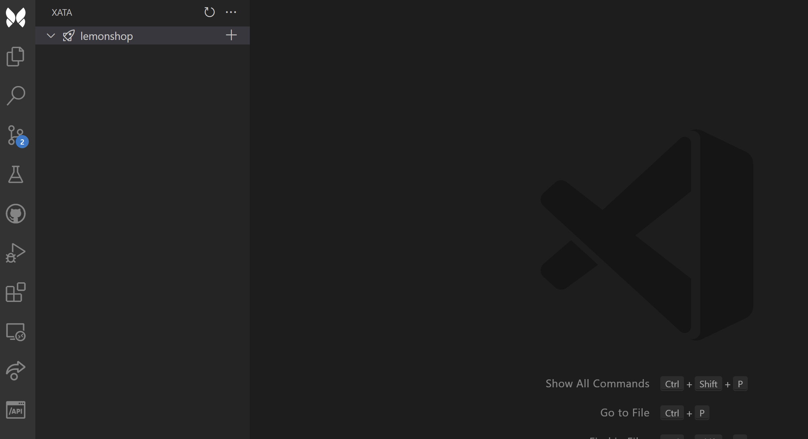
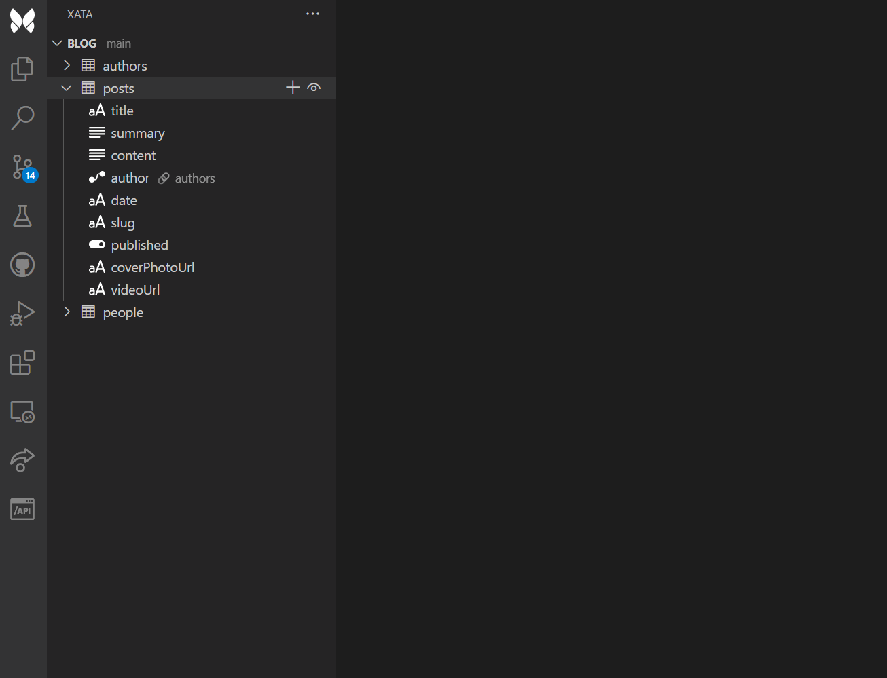

# Xata VSCode extension

Manage your xatabase schema without leaving VSCode!

## Features

### Manage your xatabase

Create workspaces, databases, branches and columns directly from the sidebar.

### Insert & preview your records

Insert your records with auto-completion / validation and preview them.

## Requirements

You need to have a xata account & personal access token. https://xata.io/

**Enjoy!**
